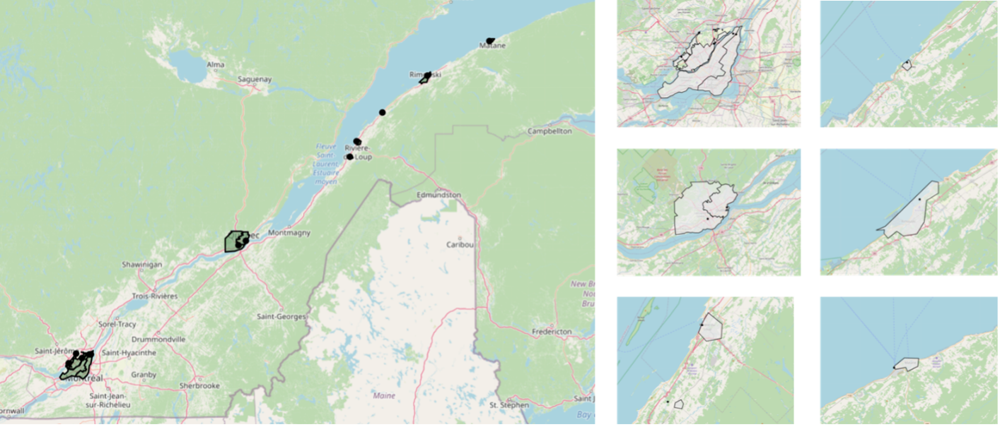

# SARS-CoV-2 wastewater surveillance data and metadata in the Open Data Model format. Part 1: Québec City

## Cite this dataset:

## Authors

- Therrien, J-D1
- Maere, T.1
- Sanchez-Quete, F.2
- Tsitouras, A.2
- Goitom, E.3
- Cloutier, F.4
- Dufour, D.4
- Proulx, F. 4
- Nicolaï, N.1
- Philippe, R.1
- Tohidi, M.1
- Dorner, S.3
- Frigon, D.2
- Vanrolleghem, P.A.1

## Affiliations

- 1 model_EAU_, Département de génie civil et de génie des eaux, Université Laval
- 2 Microbial Community Engineering Lab (MiCEL), Department of Civil Engineering, McGill University
- 3 Polytechnique Montréal
- 4 Ville de Québec

## General Remarks

Wastewater-based surveillance of SARS-CoV-2 virus can detect between 1 and 30 infected individuals per 100,000 (including asymptomatic ones) by analyzing the population's sewage. As such, this method is very attractive since it costs only a fraction of clinical testing (as low as 1%). Human faeces may contain the virus a few days before a person becomes ill. Thus, this approach allows for detection of outbreaks 2-7 days before the increase in reported cases stemming from clinical screening tests (Bibby et al., 2021). Wastewater-based surveillance complements clinical testing by geolocating outbreaks, which may help targeting intensive screening programs. Moreover, it provides a quick indication of whether new public health measures (e.g., masks, social distancing, confinement, and curfew) are effective.

## Sampling

The reported dataset contains open data collected in the province of Québec as part of the SARS-CoV-2 wastewater-based surveillance program [CentrEau](https://www.centreau.ulaval.ca/en/covid/)-COVID. Four of the largest cities in the province (Montréal, Laval, Québec City, and Trois-Rivières), as well as the municipalities of four rural regions (Mauricie, Centre-du-Québec, Bas-St-Laurent, and Gaspésie) participated in the program. The entire dataset includes 31 sampling sites covering approximately half the population of the province of Québec (population size of 8.5 million). The timeframe covered by the dataset varies for each site. The earliest surveillance program was launched in March 2020, others followed soon after. Samples were collected using various methods, such as 24h composite samples, grab samples, and passive sampling using variations on the Moore swab method (Schang et al., 2020)

<figcaption>Figure 1: Sampling locations of the CentrEau-COVID project (source: <a href=https://www.centreau.ulaval.ca/covid>CentrEau</a>)</figcaption>

## Analysis

Prior to the analysis of the samples for SARS-CoV-2, physiochemical parameters such as total suspended solids (TSS), turbidity, conductivity, ammonium concentration, and pH were measured. The samples were subsequently concentred by filtration using a MEC filter (0.45 um), followed by total RNA extraction using the Qiagen AllPrep PowerViral DNA/RNA Kit (Qiagen, USA) with some modifications (beta-mercaptoethanol concentration raised to 10% and lysis performed at 55 °C for 30 minutes) (Ahmed et al., 2020). SARS-CoV-2 viral RNA was detected by a one-step RT-qPCR. To assess the RNA recovery rate of the procedure, samples were spiked before extraction with a known concentration of Bovine Respiratory Syncytial Virus (BRSV) using the Zoetis INFORCE 3 vaccine (Zoetis, USA). In addition to SARS-CoV-2, samples were assessed for Pepper Mild Mottle Virus (PMMoV), the daily load of which is hypothesized to represent the fecal load contributions to the samples at a given site and time. PCR conditions and primers used to collect viral data are described in the files `primers.md` and `PCR conditions.md`.

## Compilation

The measurements on wastewater samples carried out by the participating laboratories of this study are found in the `WWMeasure` table. The values provided by municipalities come from laboratories accredited by the Centre d'expertise en analyse environnementale du Québec (CEAEQ), in compliance with the latter's quality assurance protocols. The COVID-19-related public health data found in the `CPHD` table were collected from the Institut National de Santé Publique du Québec (INSPQ)'s public reports. Wastewater data taken in-situ at the sampling sites (e.g., the flow at pumping stations or water resource recovery facilities (WRRFs)) are found in the `SiteMeasure` table and were taken by the institutions responsible for managing the sites. All of the data, stemming from multiple sources, were combined into the [Open Data Model (ODM)](https://github.com/Big-Life-Lab/ODM) standard format using the [ODM-Import python package](https://github.com/modelEAU/ODM-Import) (see also Structure).

<figcaption>Figure 2: Open Data Model Schematic (source: <a href=https://github.com/Big-Life-Lab/ODM>ODM</a>)</figcaption>

## Validation

Wastewater and sample data were manually assessed for quality by our research collaborators. Data points for which the quality appeared to be uncertain were tagged with the value `True` in the `qualityFlag` column. Conversely, data deemed of good quality have a quality flag of `False`. Data that were not checked have a quality flag of `NA`. Textual comments describing the issues with the data points in more detail are also included in the dataset using the `notes` column of the relevant tables. Note that data validation was carried out by the data custodians responsible for each city in the dataset according to available resources. As the project continues and data validation is undertaken on more sections of the dataset, data may be re-analyzed, flagged, or commented as needed. Revisions to the dataset will be reported to the best of our ability.

## Structure

The data contained in this dataset has been structured according to the [Open Data Model (ODM) for Wastewater-Based Surveillance](https://github.com/Big-Life-Lab/ODM). This model provides a standardized dictionary to collect and share data and metadata stemming from wastewater-based surveillance programs. By convention, it splits all data into 10+ thematic tables with each record representing a unique measurement, i.e., long format. For convenience, the `wide` folder presents the data found in all the other tables in a wide format, i.e., multiple measurements are aligned by `timestamp`, with each column representing a different parameter.

## Acknowledgements

The authors would like to acknowledge that this dataset was collected thanks to the financial support of the Fonds de Recherche du Québec, the Molson Foundation, the Trottier Family Foundation, CentrEau and NSERC. The authors would also like to acknowledge the efforts of Douglas Manuel (Ottawa Hospital) and Howard Swerdfeger (Public Health Agency of Canada) for their original idea for the Open Data Model and continued development.

## References

1. Ahmed, W., Bertsch, P.M., Bivins, A., Bibby, K., Farkas, K., Gathercole, A., Haramoto, E., Gyawali, P., Korajkic, A., McMinn, B.R., Mueller, J.F., Simpson, S.L., Smith, W.J.M., Symonds, E.M., Thomas, K. v., Verhagen, R., Kitajima, M., 2020. Comparison of virus concentration methods for the RT-qPCR-based recovery of murine hepatitis virus, a surrogate for SARS-CoV-2 from untreated wastewater. Science of the Total Environment 739. https://doi.org/10.1016/j.scitotenv.2020.139960

1. Bibby, K., Bivins, A., Wu, Z., North, D., 2021. Making waves: Plausible lead time for wastewater based epidemiology as an early warning system for COVID-19. Water Research 202, 117438. https://doi.org/10.1016/j.watres.2021.117438

1. Schang, C., Crosbie, N., Nolan, M., Poon, R., Wang, M., Jex, A., Scales, P., Schmidt, J., Thorley, B.R., Henry, R., Kolotelo, P., Langeveld, J., Schilperoort, R., Shi, B., Einsiedel, S., Thomas, M., Black, J., Wilson, S., McCarthy, D.T., 2020. Passive sampling of viruses for wastewater-based epidemiology: a case-study of SARS-CoV-2 [WWW Document]. URL https://www.researchgate.net/publication/347103410\_Passive\_sampling\_of\_viruses\_for\_wastewater-based\_epidemiology\_a\_case-study\_of\_SARS-CoV-2?channel=doi&amp;linkId=5fd800f392851c13fe892393&amp;showFulltext=true (accessed 1.18.21).
